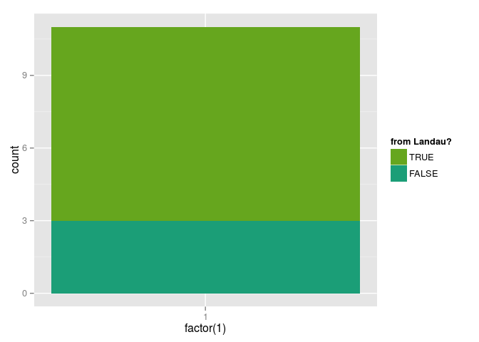

Results from questionnaire
--------------------------

### Load the data

``` r
prj <- '/home/edisz/Documents/Uni/Projects/PHD/CONFERENCES/AufLand'
df <- read.csv(file.path(prj, 'questionnaire/questionnaire.csv'), 
                 sep = ',', header = TRUE, quote = "\"", 
               stringsAsFactors = FALSE)
```

    ## 'data.frame':    11 obs. of  18 variables:
    ##  $ Timestamp                                                                                : chr  "12/10/2015 12:23:49" "12/10/2015 12:23:53" "12/10/2015 13:37:45" "12/10/2015 14:02:43" ...
    ##  $ How.would.you.categorize.your.theoretical.statistical.knowledge.                         : chr  "intermediate (e.g. I'm familiar with GLMs, model comparisons, PCA)" "intermediate (e.g. I'm familiar with GLMs, model comparisons, PCA)" "intermediate (e.g. I'm familiar with GLMs, model comparisons, PCA)" "beginner (e.g. I'm familiar with mean, variance, regression)" ...
    ##  $ Do.you.have.any..irrespective.of.language..programming.experience.                       : chr  "no" "no" "yes" "no" ...
    ##  $ How.would.you.categorize.your.R.programing.knowledge.                                    : chr  "intermediate (e.g. I know data structures and data types of R and can aggregate & plot my data)" "intermediate (e.g. I know data structures and data types of R and can aggregate & plot my data)" "advanced (I can write functions, loop over lists and automate my workflows.)" "intermediate (e.g. I know data structures and data types of R and can aggregate & plot my data)" ...
    ##  $ How.do.you.currently.do.your.statistical.analyses.                                       : chr  "I use solely R for my analyses (clean, plot, model)" "I use solely R for my analyses (clean, plot, model)" "I use solely R for my analyses (clean, plot, model)" "I use solely R for my analyses (clean, plot, model)" ...
    ##  $ Which.of.these.topics.is.the.most.interesting.for.you.                                   : chr  "Generlized linear models (GLMs) with R (from basic regression, to count/binomial data, to model checking...)" "Creating publication ready plots with ggplot2 (An introduction to the ggplot2 package)" "R package development (How to write an R package)" "Introduction to R for ecologists (Basic R, How to read data, clean and aggregate, plot data, basic statistics)" ...
    ##  $ Rank.the.five.most.interesting.topics....1..most.interesting..                           : chr  "Generlized linear models (GLMs) with R (from basic regression, to count/binomial data, to model checking...)" "Creating publication ready plots with ggplot2 (An introduction to the ggplot2 package)" "R package development (How to write an R package)" "Introduction to R for ecologists (Basic R, How to read data, clean and aggregate, plot data, basic statistics)" ...
    ##  $ Rank.the.five.most.interesting.topics....2.                                              : chr  "Creating publication ready plots with ggplot2 (An introduction to the ggplot2 package)" "Generlized linear models (GLMs) with R (from basic regression, to count/binomial data, to model checking...)" "Multivariate Statistics using the vegan package" "Creating publication ready plots with ggplot2 (An introduction to the ggplot2 package)" ...
    ##  $ Rank.the.five.most.interesting.topics....3.                                              : chr  "Multivariate Statistics using the vegan package" "Multivariate Statistics using the vegan package" "Creating publication ready plots with ggplot2 (An introduction to the ggplot2 package)" "Generlized linear models (GLMs) with R (from basic regression, to count/binomial data, to model checking...)" ...
    ##  $ Rank.the.five.most.interesting.topics....4.                                              : chr  "Introduction to R programming (data types & structures, writing functions, repetitive tasks, no statistics)" "Introduction to R programming (data types & structures, writing functions, repetitive tasks, no statistics)" "Introduction to R programming (data types & structures, writing functions, repetitive tasks, no statistics)" "Multivariate Statistics using the vegan package" ...
    ##  $ Rank.the.five.most.interesting.topics....5..least.interesting..                          : chr  "Introduction to R for ecologists (Basic R, How to read data, clean and aggregate, plot data, basic statistics)" "Introduction to R for ecologists (Basic R, How to read data, clean and aggregate, plot data, basic statistics)" "Reproducible and Open Science using R and git" "Introduction to R programming (data types & structures, writing functions, repetitive tasks, no statistics)" ...
    ##  $ Do.you.have.any.other.topic.suggestions.                                                 : chr  "" "" "" "" ...
    ##  $ Do.you.have.the.necessary.R.and.theoritcal.background.for.the.topic.you.re.interested.in.: chr  "Maybe (I am unsure about my theory knowledge, but R is good)" "Maybe (I am unsure about my theory knowledge, but R is good)" "Maybe (I am unsure about my theory knowledge, but R is good)" "Definitively (I know the R basics and the theory)" ...
    ##  $ Name                                                                                     : chr  "Steffi" "Anna Kästel" "Friedrich Viedt " "Bonny" ...
    ##  $ Email                                                                                    : chr  "allgeier@uni-landau.de" "Kaestel@uni-landau.de" "vied2934@uni-landau.de" "krell@uni-landau.de" ...
    ##  $ Affiliation                                                                              : chr  "Uni Landau" "Uni Landau" "Universität Koblenz-Landau " "University Koblenz Landau" ...
    ##  $ Position                                                                                 : chr  "PhD" "PhD student" "" "PhD" ...
    ##  $ I.will.bring.my.own.laptop                                                               : chr  "yes" "yes" "no" "yes" ...

Looks OK, but quite long column names....

### Clean the data

``` r
# shorten the colnames
colnames(df) <- c('date', 'theory', 'prog', 'rknow', 'curr', 'inter', 'one', 
                  'two', 'three', 'four', 'five', 'sugg', 'backg', 'name', 'email', 'affl', 'pos', 'laptop')
str(df)
```

    ## 'data.frame':    11 obs. of  18 variables:
    ##  $ date  : chr  "12/10/2015 12:23:49" "12/10/2015 12:23:53" "12/10/2015 13:37:45" "12/10/2015 14:02:43" ...
    ##  $ theory: chr  "intermediate (e.g. I'm familiar with GLMs, model comparisons, PCA)" "intermediate (e.g. I'm familiar with GLMs, model comparisons, PCA)" "intermediate (e.g. I'm familiar with GLMs, model comparisons, PCA)" "beginner (e.g. I'm familiar with mean, variance, regression)" ...
    ##  $ prog  : chr  "no" "no" "yes" "no" ...
    ##  $ rknow : chr  "intermediate (e.g. I know data structures and data types of R and can aggregate & plot my data)" "intermediate (e.g. I know data structures and data types of R and can aggregate & plot my data)" "advanced (I can write functions, loop over lists and automate my workflows.)" "intermediate (e.g. I know data structures and data types of R and can aggregate & plot my data)" ...
    ##  $ curr  : chr  "I use solely R for my analyses (clean, plot, model)" "I use solely R for my analyses (clean, plot, model)" "I use solely R for my analyses (clean, plot, model)" "I use solely R for my analyses (clean, plot, model)" ...
    ##  $ inter : chr  "Generlized linear models (GLMs) with R (from basic regression, to count/binomial data, to model checking...)" "Creating publication ready plots with ggplot2 (An introduction to the ggplot2 package)" "R package development (How to write an R package)" "Introduction to R for ecologists (Basic R, How to read data, clean and aggregate, plot data, basic statistics)" ...
    ##  $ one   : chr  "Generlized linear models (GLMs) with R (from basic regression, to count/binomial data, to model checking...)" "Creating publication ready plots with ggplot2 (An introduction to the ggplot2 package)" "R package development (How to write an R package)" "Introduction to R for ecologists (Basic R, How to read data, clean and aggregate, plot data, basic statistics)" ...
    ##  $ two   : chr  "Creating publication ready plots with ggplot2 (An introduction to the ggplot2 package)" "Generlized linear models (GLMs) with R (from basic regression, to count/binomial data, to model checking...)" "Multivariate Statistics using the vegan package" "Creating publication ready plots with ggplot2 (An introduction to the ggplot2 package)" ...
    ##  $ three : chr  "Multivariate Statistics using the vegan package" "Multivariate Statistics using the vegan package" "Creating publication ready plots with ggplot2 (An introduction to the ggplot2 package)" "Generlized linear models (GLMs) with R (from basic regression, to count/binomial data, to model checking...)" ...
    ##  $ four  : chr  "Introduction to R programming (data types & structures, writing functions, repetitive tasks, no statistics)" "Introduction to R programming (data types & structures, writing functions, repetitive tasks, no statistics)" "Introduction to R programming (data types & structures, writing functions, repetitive tasks, no statistics)" "Multivariate Statistics using the vegan package" ...
    ##  $ five  : chr  "Introduction to R for ecologists (Basic R, How to read data, clean and aggregate, plot data, basic statistics)" "Introduction to R for ecologists (Basic R, How to read data, clean and aggregate, plot data, basic statistics)" "Reproducible and Open Science using R and git" "Introduction to R programming (data types & structures, writing functions, repetitive tasks, no statistics)" ...
    ##  $ sugg  : chr  "" "" "" "" ...
    ##  $ backg : chr  "Maybe (I am unsure about my theory knowledge, but R is good)" "Maybe (I am unsure about my theory knowledge, but R is good)" "Maybe (I am unsure about my theory knowledge, but R is good)" "Definitively (I know the R basics and the theory)" ...
    ##  $ name  : chr  "Steffi" "Anna Kästel" "Friedrich Viedt " "Bonny" ...
    ##  $ email : chr  "allgeier@uni-landau.de" "Kaestel@uni-landau.de" "vied2934@uni-landau.de" "krell@uni-landau.de" ...
    ##  $ affl  : chr  "Uni Landau" "Uni Landau" "Universität Koblenz-Landau " "University Koblenz Landau" ...
    ##  $ pos   : chr  "PhD" "PhD student" "" "PhD" ...
    ##  $ laptop: chr  "yes" "yes" "no" "yes" ...

From the `affl` column, we see that the Uni-Landau was entered in different ways. Lets create a new column coding if the attendee comes from Landau.

We can use columns `email` and `affl` to check if an attendee come form landau. We use [regular expressions](https://en.wikipedia.org/wiki/Regular_expression) to match the word 'landau' in both columns. Note, that I compare only lowercase strings, as this saves 2 comparisons.

Character vectors can be translated to lowercase using `tolower()`:

``` r
tolower(df$affl)
```

    ##  [1] "uni landau"                     "uni landau"                    
    ##  [3] "universität koblenz-landau "    "university koblenz landau"     
    ##  [5] ""                               "wassercluster lunz"            
    ##  [7] "csic"                           "uni landau"                    
    ##  [9] "university of basel"            "uni landau, molecular ecology "
    ## [11] "uni landau"

We can check if a string contains `'landau'` using the function `grepl()` (= global regular expression, l stands for logical which is the output):

``` r
grepl(pattern = 'landau', df$email)
```

    ##  [1]  TRUE  TRUE  TRUE  TRUE  TRUE FALSE FALSE FALSE FALSE  TRUE  TRUE

I a last step we combine both using the logical `OR` and save as new variable:

``` r
df$fromlandau <- grepl(pattern = 'landau', df$email) | grepl(pattern = 'landau', tolower(df$affl))
```

### Plot the data

#### How many attendies replied?

We have only 11 repsonses:

``` r
nrow(df)
```

    ## [1] 11

from which the majority

``` r
sum(df$fromlandau)
```

    ## [1] 8

are from Landau.

``` r
require(ggplot2)
```

    ## Loading required package: ggplot2

``` r
require(RColorBrewer)
```

    ## Loading required package: RColorBrewer

``` r
classPalette = colorRampPalette(brewer.pal(5, "Dark2"))
```

``` r
nlev <- length(unique(df$fromlandau))
ggplot(df, aes(x = factor(1), fill = df$fromlandau)) +
  geom_bar() +
  scale_fill_manual(values = classPalette(nlev)) +
  guides(fill= guide_legend(reverse=TRUE, title = 'from Landau?'))
```


